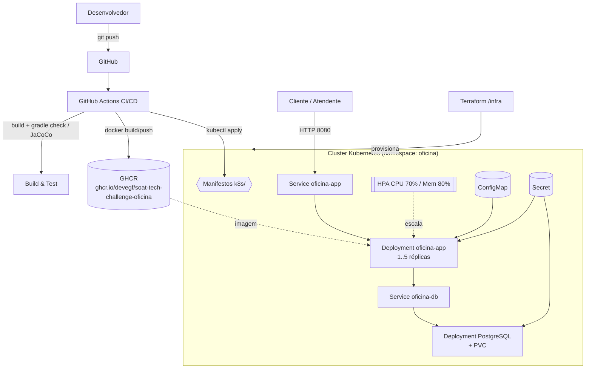

# Oficina

Monólito **Kotlin** com **Spring Boot** (JPA, Flyway, Spring Security OAuth2 Resource Server + JWT emitido pela aplicação), organizado em **arquitetura em camadas** alinhada ao Tech Challenge SOAT (MVP oficina mecânica).

## Documentação de Arquitetura

A documentação C4 completa (System Context, Container, Component, ER diagram e fluxos de negócio) está em [`oficina/docs/c4/`](oficina/docs/c4/) — veja o **[índice completo](oficina/docs/c4/INDEX.md)** para navegar por todos os diagramas e roteiros de leitura.

## Stack

**Backend** (`oficina/`)
- Kotlin 2.3, Java 17, Gradle
- Spring Boot 4.1.0 (web, data-jpa, validation, flyway, security, oauth2-resource-server, actuator)
- OpenAPI / Swagger UI (springdoc)
- Banco de dados: **PostgreSQL** + **Flyway** (migrations V1–V6 em `oficina/src/main/resources/db/migration`)
- Email: notificações via **Resend** atrás da porta de domínio `NotificationPort` (opcional; configurada via `APP_RESEND_API_KEY`, no-op sem chave)

**Frontend** (`frontend/`)
- Vite + TypeScript (React)
- Aplicação de acompanhamento de OS pelo cliente

## Linguagem ubíqua (resumo)

| Termo | Significado |
| ----- | ----------- |
| **Ordem de serviço (OS)** | Recebida → Em diagnóstico → Aguardando aprovação interna → (reprovação interna → **Cancelada**) ou aprovação admin → atendente envia orçamento → Aguardando aprovação do cliente → Em execução → Finalizada → Entregue (ou cancelada pelo cliente). |
| **Documento (CPF/CNPJ)** | Identificação do cliente; validação de dígitos no domínio. |
| **Placa** | Identificação do veículo (padrão antigo ou Mercosul). |
| **Serviço (catálogo)** | Serviço cadastrado com preço e tempo estimado. |
| **Peça / insumo** | Estoque físico; **reserva** ao submeter o plano (técnico); **baixa** na confirmação de saída pelo almoxarife; **ponto de reposição** para alerta de estoque baixo. |
| **Código de acompanhamento** | UUID público da OS para consulta pelo cliente. |

Documentação DDD (Event Storming, diagramas) deve ser mantida no **Miro** (ou equivalente), conforme enunciado da disciplina.

## Estrutura de camadas

| Camada | Pacote | Papel |
| ------ | ------ | ----- |
| **Domain** | `...domain` | Modelo, value objects, exceções de domínio, portas. |
| **Application** | `...application` | Casos de uso, DTOs de API internos, orquestração. |
| **Infrastructure** | `...infrastructure` | JPA, Flyway, adapters, JWT, Jackson, OpenAPI. |
| **Presentation** | `...presentation` | Controllers REST (`presentation` porque `interface` é palavra reservada). |

## API REST (visão geral)

- **OpenAPI JSON:** `http://localhost:8080/v3/api-docs`
- **Swagger UI:** `http://localhost:8080/swagger-ui.html`
- **Login (público):** `POST /api/public/auth/login` — o JWT inclui escopos conforme o usuário (veja usuários demo abaixo).
- **Cliente (público, sem token):**
  - `GET /api/public/os/acompanhar?documento=&codigo=`
  - `POST /api/public/os/orcamento/decisao` — **decisão por payload JSON** (`{ "documento", "codigo", "decisao": "APROVADO" | "RECUSADO" }`), idempotente (Fase 2)
  - `POST /api/public/os/aprovar-orcamento?documento=&codigo=` *(legado, mantido por compatibilidade)*
  - `POST /api/public/os/reprovar-orcamento?documento=&codigo=` *(legado)*

### Usuários in-memory (senha = username, exceto admin)

| Usuário      | Senha padrão | Escopo JWT   | Uso principal |
| ------------ | ------------ | ------------ | ------------- |
| `atendente`  | `atendente`  | `ATTENDANT`  | Criar OS, enviar orçamento ao cliente, entrega, voltar diagnóstico |
| `tecnico`    | `tecnico`    | `TECHNICIAN` | Diagnóstico, submeter plano (reserva), concluir serviços |
| `admin`      | `admin` (ou `APP_SECURITY_ADMIN_PASSWORD`) | `ADMIN` | Aprovar/reprovar plano interno, CRUD catálogo/peças/clientes/veículos, entrada de mercadoria, métricas |
| `almoxarife` | `almoxarife` | `WAREHOUSE`  | Listar reservas pendentes por OS, confirmar saída (baixa física), alertas de estoque baixo |

### Prefixos protegidos

- `/api/admin/**` — `SCOPE_ADMIN` (clientes, veículos, catálogo, peças + `POST .../pecas/{id}/entrada-mercadoria`, OS interno aprovar/reprovar, métricas).
- `/api/attendant/ordens-servico/**` — `SCOPE_ATTENDANT`.
- `/api/technician/ordens-servico/**` — `SCOPE_TECHNICIAN`.
- `/api/warehouse/**` — `SCOPE_WAREHOUSE` (reservas pendentes, confirmar saída, alertas).

Fluxo resumido: técnico `submeter-plano` → admin `aprovar-interno` → atendente `enviar-orcamento-cliente` → cliente aprova/reprova (público) → almoxarife `confirmar-saida` → técnico `concluir-servicos` → atendente `registrar-entrega`.

## Escolha do banco de dados

**PostgreSQL**: relacional, ACID, aderente a JPA, integridade entre clientes, veículos, itens de OS e estoque. Flyway versiona o schema em `db/migration/V1__init.sql`.

## Como executar

### Local (Gradle)

Na pasta [`oficina/`](oficina/):

```bash
./gradlew bootRun
```

Propriedades úteis (ver [`oficina/src/main/resources/application.properties`](oficina/src/main/resources/application.properties)):

- `app.jwt.secret` / `APP_JWT_SECRET`
- `app.security.admin.password` / `APP_SECURITY_ADMIN_PASSWORD` (senha do usuário **admin**; demais usuários demo usam senha igual ao username)

### Docker Compose (aplicação + PostgreSQL)

Na **raiz** do repositório:

```bash
cp .env.example .env
```

Edite `.env` (Postgres, datasource e **JWT/admin**). O Compose define **URL e usuário** padrão para o JDBC (`jdbc:postgresql://db:5432/oficina` / `oficina`) se não estiverem no `.env`; a **senha** (`SPRING_DATASOURCE_PASSWORD`) continua obrigatória via `.env` (igual à `POSTGRES_PASSWORD`). No perfil **docker**, **Spring Session está desligado** (`store-type=none`), pois a API usa JWT stateless e a sessão JDBC gerava conflito de DataSource quando variáveis vinham vazias.

Exemplo:

```dotenv
POSTGRES_DB=oficina
POSTGRES_USER=oficina
POSTGRES_PASSWORD=change-me-in-local-env

SPRING_DATASOURCE_URL=jdbc:postgresql://db:5432/oficina
SPRING_DATASOURCE_USERNAME=oficina
SPRING_DATASOURCE_PASSWORD=change-me-in-local-env

APP_JWT_SECRET=change-me-long-random-secret-for-hs256
# Senha do login "admin" (Postman/demo); altere em produção.
APP_SECURITY_ADMIN_PASSWORD=admin

# Email via Resend (opcional; sem chave o envio é simplesmente ignorado)
APP_RESEND_API_KEY=
APP_RESEND_FROM_EMAIL=noreply@oficinasys.local
```

```bash
docker compose up --build
```

- API: `http://localhost:8080`
- Health: `http://localhost:8080/actuator/health`

## Fase 2 — Infraestrutura, escalabilidade e automação

A Fase 2 evolui o MVP da Fase 1 com foco em **qualidade de código (Clean/Hexagonal),
resiliência, escalabilidade e automação de infraestrutura**:

- **Clean Architecture:** notificações isoladas atrás da porta de domínio
  `NotificationPort`, com adapter Resend na infraestrutura (a aplicação não conhece
  mais detalhes de rede/HTTP).
- **Listagem de OS** ordenada por prioridade de status + FIFO (`createdAt`), excluindo
  OS finalizadas/entregues.
- **Notificação externa de orçamento** via endpoint JSON idempotente.
- **Containerização** endurecida (não-root, healthcheck, JRE fixa).
- **Kubernetes** com autoescala horizontal (HPA).
- **Terraform** provisionando um cluster local (kind).
- **CI/CD** (GitHub Actions): build + testes → imagem no GHCR → deploy.

### Arquitetura



### Fluxo de deploy

1. **Terraform** (`/infra`) cria o cluster kind local e instala o `metrics-server` (pré-requisito do HPA).
2. **CI/CD** builda e publica a imagem no **GHCR** a cada push na `main`.
3. **Manifestos** (`/k8s`) sobem PostgreSQL (com PVC), a aplicação (com probes e
   `resources`) e o **HPA**, que escala de 1 a 5 réplicas conforme CPU/memória.

### Provisionar o cluster (Terraform)

```bash
cd infra
cp terraform.tfvars.example terraform.tfvars
terraform init && terraform apply
export KUBECONFIG="$(terraform output -raw kubeconfig_path)"
```

Detalhes e recursos criados: **[`infra/README.md`](infra/README.md)**.

### Deploy no Kubernetes

```bash
cp k8s/11-secret.example.yaml k8s/11-secret.yaml   # preencha os segredos
kubectl apply -f k8s/
kubectl -n oficina get pods,hpa
kubectl -n oficina port-forward svc/oficina-app 8080:8080
```

Detalhes (metrics-server, carga de imagem no kind, demo do HPA): **[`k8s/README.md`](k8s/README.md)**.

### CI/CD

Pipeline em [`.github/workflows/ci-cd.yml`](.github/workflows/ci-cd.yml):

| Job | Quando | Função |
| --- | ------ | ------ |
| `build-test` | push + PR | `./gradlew check bootJar` (testes + cobertura JaCoCo) |
| `docker` | push | build e push da imagem no GHCR (tags `sha` e `latest`) |
| `deploy` | push na `main` | cluster kind efêmero, aplica `k8s/` e faz smoke test em `/actuator/health` |

### Validar localmente

Para validar tudo (testes, Docker, Kubernetes) de uma vez, sem decorar comandos:

```powershell
pwsh ./scripts/validar-fase2.ps1          # testes + sobe a app via compose
pwsh ./scripts/validar-fase2.ps1 -All     # inclui o deploy em kind
```

- Script: [`scripts/validar-fase2.ps1`](scripts/validar-fase2.ps1)
- **Nunca usou essas ferramentas?** Guia de instalação e uso passo a passo (Windows):
  **[`docs/FERRAMENTAS-FASE2.md`](docs/FERRAMENTAS-FASE2.md)**.

## Testes e cobertura

```bash
cd oficina
./gradlew check
```

- Testes unitários e de integração (incluindo fluxo principal da OS com MockMvc + segurança).
- **JaCoCo:** `check` executa `jacocoTestCoverageVerification` com **mínimo de 80% de linhas** nos pacotes `domain` e `application` (classes de DTO em `application.api.dto` excluídas do cálculo por serem apenas estruturas de dados).
- Relatório HTML: `oficina/build/reports/jacoco/test/html/index.html`.

## Coleção de APIs (Postman)

- Collection: [`oficina/docs/postman/Oficina.postman_collection.json`](oficina/docs/postman/Oficina.postman_collection.json)
- Environment local: [`oficina/docs/postman/Oficina-Local.postman_environment.json`](oficina/docs/postman/Oficina-Local.postman_environment.json)
- Alternativa: **Swagger UI** em `http://localhost:8080/swagger-ui.html`.

## Vídeo demonstrativo

> _A definir_ — link do vídeo (até 15 min) demonstrando deploy, execução do CI/CD,
> consumo das APIs e a escalabilidade automática (HPA sob carga).

## Relatório de vulnerabilidades

Modelo e instruções de scan: [docs/security-scans/](oficina/docs/security-scans/). Inclua a saída das ferramentas no PDF de entrega da disciplina.

## Entrega (checklist institucional)

- Vídeo (até 15 min), documentação DDD no Miro, repositório privado com acesso **soat-architecture**, PDF de entrega com links e relatório de vulnerabilidades (preencher o modelo acima).
