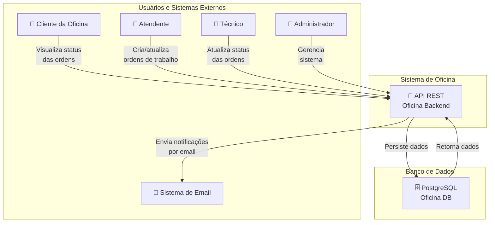

# C1 - System Context

## Visão Geral

O diagrama C1 (System Context) mostra o sistema de gerenciamento de oficina em relação aos seus usuários e sistemas externos.

## Diagrama



## Descrição dos Atores

### 👤 Cliente da Oficina
**Responsabilidade**: Cliente que solicita serviços na oficina.
- **Acessos**: 
  - Visualizar suas próprias ordens de trabalho
  - Consultar status de andamento
- **Limitações**: Sem acesso a informações de outras clientes

### 👤 Atendente
**Responsabilidade**: Recebe clientes e cria ordens de trabalho.
- **Acessos**:
  - Criar novas ordens de trabalho
  - Atualizar informações de ordens
  - Visualizar peças disponíveis
  - Consultar catálogo de serviços
- **Limitações**: Sem acesso a métricas e relatórios avançados

### 👤 Técnico
**Responsabilidade**: Executa os trabalhos nas ordens de trabalho.
- **Acessos**:
  - Visualizar ordens de trabalho atribuídas
  - Atualizar status de andamento
  - Registrar peças utilizadas
  - Atualizar catálogo de serviços
- **Limitações**: Sem acesso a gerenciamento de clientes

### 👤 Administrador
**Responsabilidade**: Gerencia configurações e dados do sistema.
- **Acessos**:
  - Acesso total a todos os recursos
  - Gerenciar usuários
  - Visualizar métricas
  - Gerenciar peças e veículos
- **Limitações**: Nenhuma

### 📧 Sistema de Email
**Responsabilidade**: Entrega de notificações por email.
- **Interação**: A aplicação envia notificações quando ordens são atualizadas
- **Tipo**: Sistema externo (não detalhado neste diagrama)

## Descrição do Sistema

### 🔌 API REST - Oficina Backend
**Responsabilidade**: Gerenciar toda a lógica de negócio da oficina.

**Principais Responsabilidades**:
1. **Gerenciamento de Clientes**: Cadastro e manutenção de informações de clientes
2. **Gerenciamento de Veículos**: Cadastro de veículos e suas características
3. **Gerenciamento de Ordens de Trabalho**: Criação, atualização e rastreamento
4. **Gerenciamento de Peças**: Controle de estoque e disponibilidade
5. **Catálogo de Serviços**: Manutenção de serviços oferecidos
6. **Autenticação e Autorização**: Controle de acesso baseado em JWT
7. **Métricas**: Geração de relatórios e análises

### 🗄️ PostgreSQL - Banco de Dados
**Responsabilidade**: Persistência de todos os dados do sistema.

## Fluxos de Interação Principais

### 1. Criação de Ordem de Trabalho
```
Cliente solicita serviço → Atendente cria ordem → Ordem armazenada no BD
```

### 2. Execução de Trabalho
```
Técnico visualiza ordem → Atualiza status → Registra peças usadas → Ordem armazenada no BD
```

### 3. Acompanhamento
```
Cliente consulta status → API retorna informações → Cliente visualiza andamento
```

### 4. Notificações
```
Ordem atualizada → API envia notificação → Sistema de Email entrega mensagem
```

## Limitações e Considerações

1. **Autenticação**: Sistema baseado em JWT, requer token válido em todas as requisições
2. **Escalabilidade**: Atualmente single-instance, considera-se load balancing para produção
3. **Disponibilidade**: Dependência crítica do PostgreSQL
4. **Notificações**: Email síncrono, considerar async para melhor performance
5. **Auditoria**: Todas as operações são auditadas para rastreabilidade

## Cenários de Uso Principais

### Cenário 1: Cliente Solicita Serviço
1. Cliente entra em contato com a oficina
2. Atendente acessa a API
3. Atendente cria nova ordem de trabalho
4. Sistema envia confirmação por email
5. Cliente pode acompanhar status em tempo real

### Cenário 2: Técnico Executa Trabalho
1. Técnico acessa a API
2. Consulta ordens atribuídas
3. Atualiza status conforme trabalho avança
4. Registra peças utilizadas
5. Marca como concluído
6. Sistema gera nota de saída

### Cenário 3: Admin Gera Relatórios
1. Administrador acessa endpoint de métricas
2. Sistema retorna dados agregados
3. Admin analisa performance e eficiência

---

**Próximo passo**: Ver [C2 - Container](./C2_container.md) para entender os componentes principais da aplicação.
