# C3 - Component

## Visão Geral

O diagrama C3 (Component) detalha a estrutura interna da aplicação, mostrando os controladores, serviços, repositórios e entidades de domínio.

## Diagrama Geral de Componentes

```mermaid
graph TB
    subgraph "API REST - Presentation Layer"
        AUTH_CTRL["🔐 AuthController<br/>POST /auth/login"]
        CUSTOMER_CTRL["👥 AdminCustomerController<br/>GET/POST /customers"]
        VEHICLE_CTRL["🚗 AdminVehicleController<br/>GET/POST /vehicles"]
        
        WO_ADMIN["📋 AdminWorkOrderController<br/>GET /work-orders"]
        WO_TECH["🔧 TechnicianWorkOrderController<br/>PUT /work-orders"]
        WO_ATT["📞 AttendantWorkOrderController<br/>POST /work-orders"]
        WO_PUBLIC["👁️ PublicWorkOrderController<br/>GET /work-orders/{id}"]
        
        PART_TECH["📦 TechnicianPartController<br/>PUT /parts"]
        PART_ADMIN["📦 AdminPartController<br/>GET/POST /parts"]
        
        CATALOG_TECH["📚 TechnicianCatalogServiceController<br/>PUT /catalog"]
        CATALOG_ADMIN["📚 AdminCatalogServiceController<br/>GET/POST /catalog"]
        
        WAREHOUSE["🏭 WarehouseController<br/>GET /warehouse"]
        METRICS["📊 AdminMetricsController<br/>GET /metrics"]
        EXCEPTION["⚠️ RestExceptionHandler"]
    end
    
    subgraph "Application Layer - Services"
        CUSTOMER_SVC["CustomerApplicationService<br/>- create()<br/>- update()<br/>- findAll()"]
        VEHICLE_SVC["VehicleApplicationService<br/>- create()<br/>- update()<br/>- findAll()"]
        WO_SVC["WorkOrderApplicationService<br/>- create()<br/>- update()<br/>- updateStatus()"]
        PART_SVC["PartApplicationService<br/>- create()<br/>- update()<br/>- consume()"]
        CATALOG_SVC["CatalogServiceApplicationService<br/>- create()<br/>- update()"]
        WAREHOUSE_SVC["WarehouseApplicationService<br/>- getInventory()"]
        METRICS_SVC["MetricsApplicationService<br/>- generateReport()"]
        EMAIL_SVC["ResendEmailService<br/>- sendNotification()"]
    end
    
    subgraph "Domain Layer - Models & Ports"
        CUSTOMER_DOMAIN["Customer<br/>- id<br/>- name<br/>- email<br/>- phone"]
        VEHICLE_DOMAIN["Vehicle<br/>- id<br/>- plate<br/>- brand<br/>- model"]
        WO_DOMAIN["WorkOrder<br/>- id<br/>- customer<br/>- vehicle<br/>- status<br/>- parts[]"]
        PART_DOMAIN["Part<br/>- id<br/>- name<br/>- quantity<br/>- price"]
        CATALOG_DOMAIN["CatalogService<br/>- id<br/>- name<br/>- description<br/>- price"]
        USER_DOMAIN["User<br/>- id<br/>- username<br/>- role<br/>- password"]
        
        CUSTOMER_PORT["ICustomerRepository<br/>(Port)"]
        VEHICLE_PORT["IVehicleRepository<br/>(Port)"]
        WO_PORT["IWorkOrderRepository<br/>(Port)"]
        PART_PORT["IPartRepository<br/>(Port)"]
        CATALOG_PORT["ICatalogRepository<br/>(Port)"]
    end
    
    subgraph "Infrastructure Layer - Repositories"
        CUSTOMER_REPO["CustomerRepository<br/>(JPA)<br/>extends CrudRepository"]
        VEHICLE_REPO["VehicleRepository<br/>(JPA)<br/>extends CrudRepository"]
        WO_REPO["WorkOrderRepository<br/>(JPA)<br/>extends CrudRepository"]
        PART_REPO["PartRepository<br/>(JPA)<br/>extends CrudRepository"]
        CATALOG_REPO["CatalogServiceRepository<br/>(JPA)<br/>extends CrudRepository"]
        USER_REPO["UserRepository<br/>(JPA)<br/>extends CrudRepository"]
    end
    
    subgraph "Infrastructure Layer - Entities"
        CUSTOMER_ENTITY["CustomerEntity<br/>@Entity<br/>@Table customers"]
        VEHICLE_ENTITY["VehicleEntity<br/>@Entity<br/>@Table vehicles"]
        WO_ENTITY["WorkOrderEntity<br/>@Entity<br/>@Table work_orders"]
        PART_ENTITY["PartEntity<br/>@Entity<br/>@Table parts"]
        CATALOG_ENTITY["ServiceEntity<br/>@Entity<br/>@Table catalog_services"]
        USER_ENTITY["UserEntity<br/>@Entity<br/>@Table users"]
    end
    
    subgraph "Infrastructure Layer - Configuration"
        JWT_CONFIG["JwtConfiguration<br/>- validationKey()<br/>- issuerUri()"]
        JWT_ISSUER["JwtIssuerService<br/>- issueToken()<br/>- validateToken()"]
        SECURITY_CONFIG["SecurityConfiguration<br/>- filterChain()<br/>- passwordEncoder()"]
        JACKSON_CONFIG["JacksonKotlinConfiguration<br/>- objectMapper()"]
        CLOCK_CONFIG["ClockConfiguration<br/>- clock()"]
        OPENAPI_CONFIG["OpenApiConfiguration<br/>- apiInfo()"]
    end
    
    subgraph "Infrastructure Layer - Persistence"
        MIGRATIONS["Flyway Migrations<br/>V001_Initial_Schema.sql<br/>V002_Add_Audit_Fields.sql<br/>..."]
    end
    
    AUTH_CTRL -->|"authenticate"| CUSTOMER_SVC
    CUSTOMER_CTRL -->|"manage customers"| CUSTOMER_SVC
    VEHICLE_CTRL -->|"manage vehicles"| VEHICLE_SVC
    WO_ADMIN -->|"view orders"| WO_SVC
    WO_TECH -->|"update status"| WO_SVC
    WO_ATT -->|"create orders"| WO_SVC
    WO_PUBLIC -->|"track order"| WO_SVC
    PART_TECH -->|"register usage"| PART_SVC
    PART_ADMIN -->|"manage parts"| PART_SVC
    CATALOG_TECH -->|"update services"| CATALOG_SVC
    CATALOG_ADMIN -->|"manage catalog"| CATALOG_SVC
    WAREHOUSE -->|"check inventory"| WAREHOUSE_SVC
    METRICS -->|"generate metrics"| METRICS_SVC
    
    CUSTOMER_SVC -->|"apply business rules"| CUSTOMER_DOMAIN
    VEHICLE_SVC -->|"apply business rules"| VEHICLE_DOMAIN
    WO_SVC -->|"apply business rules"| WO_DOMAIN
    PART_SVC -->|"apply business rules"| PART_DOMAIN
    CATALOG_SVC -->|"apply business rules"| CATALOG_DOMAIN
    EMAIL_SVC -->|"notify events"| WO_DOMAIN
    
    CUSTOMER_SVC -->|"use port"| CUSTOMER_PORT
    VEHICLE_SVC -->|"use port"| VEHICLE_PORT
    WO_SVC -->|"use port"| WO_PORT
    PART_SVC -->|"use port"| PART_PORT
    CATALOG_SVC -->|"use port"| CATALOG_PORT
    
    CUSTOMER_PORT -->|"implements"| CUSTOMER_REPO
    VEHICLE_PORT -->|"implements"| VEHICLE_REPO
    WO_PORT -->|"implements"| WO_REPO
    PART_PORT -->|"implements"| PART_REPO
    CATALOG_PORT -->|"implements"| CATALOG_REPO
    
    CUSTOMER_REPO -->|"map to/from"| CUSTOMER_ENTITY
    VEHICLE_REPO -->|"map to/from"| VEHICLE_ENTITY
    WO_REPO -->|"map to/from"| WO_ENTITY
    PART_REPO -->|"map to/from"| PART_ENTITY
    CATALOG_REPO -->|"map to/from"| CATALOG_ENTITY
    USER_REPO -->|"map to/from"| USER_ENTITY
    
    CUSTOMER_ENTITY -->|"persist in"| MIGRATIONS
    VEHICLE_ENTITY -->|"persist in"| MIGRATIONS
    WO_ENTITY -->|"persist in"| MIGRATIONS
    PART_ENTITY -->|"persist in"| MIGRATIONS
    CATALOG_ENTITY -->|"persist in"| MIGRATIONS
    USER_ENTITY -->|"persist in"| MIGRATIONS
    
    JWT_CONFIG -->|"configure"| SECURITY_CONFIG
    JWT_ISSUER -->|"validate in"| AUTH_CTRL
    SECURITY_CONFIG -->|"protect"| AUTH_CTRL
    JACKSON_CONFIG -->|"serialize/deserialize"| AUTH_CTRL
    CLOCK_CONFIG -->|"provide time"| WO_SVC
    OPENAPI_CONFIG -->|"document"| AUTH_CTRL
    
    EXCEPTION -->|"handles exceptions from"| AUTH_CTRL
    EXCEPTION -->|"handles exceptions from"| CUSTOMER_CTRL
    EXCEPTION -->|"handles exceptions from"| VEHICLE_CTRL
    
    style AUTH_CTRL fill:#4A90E2,color:#fff
    style EXCEPTION fill:#E24A4A,color:#fff
    style CUSTOMER_SVC fill:#7E57C2,color:#fff
    style VEHICLE_SVC fill:#7E57C2,color:#fff
    style WO_SVC fill:#7E57C2,color:#fff
    style CUSTOMER_DOMAIN fill:#5C7CBA,color:#fff
    style CUSTOMER_REPO fill:#26A69A,color:#fff
```



## Controladores (Presentation Layer)

### AuthController
**Localização**: `presentation/AuthController.kt`

**Responsabilidades**:
- Autenticar usuários
- Gerar tokens JWT
- Gerenciar sessões

**Endpoints**:
```
POST /auth/login
  Request: { username, password }
  Response: { token, expiresIn }
```

**Segurança**:
- Sem autenticação necessária
- Rate limiting recomendado
- Validação de credentials contra User repository

### AdminCustomerController
**Localização**: `presentation/AdminCustomerController.kt`

**Responsabilidades**:
- CRUD de clientes
- Gerenciamento de informações

**Endpoints**:
```
GET    /customers           → Listar clientes (com paginação)
POST   /customers           → Criar cliente
GET    /customers/{id}      → Obter detalhes
PUT    /customers/{id}      → Atualizar cliente
DELETE /customers/{id}      → Deletar cliente
```

**Autorização**: ROLE_ADMIN

### AdminVehicleController
**Localização**: `presentation/AdminVehicleController.kt`

**Endpoints**:
```
GET    /vehicles            → Listar veículos
POST   /vehicles            → Criar veículo
GET    /vehicles/{id}       → Obter detalhes
PUT    /vehicles/{id}       → Atualizar veículo
DELETE /vehicles/{id}       → Deletar veículo
```

**Autorização**: ROLE_ADMIN

### WorkOrder Controllers
Três controladores especializados para diferentes papéis:

#### AdminWorkOrderController
**Endpoints**:
```
GET /work-orders            → Listar todas as ordens
GET /work-orders/{id}       → Detalhes completos
```

#### TechnicianWorkOrderController
**Endpoints**:
```
PUT /work-orders/{id}       → Atualizar status
PUT /work-orders/{id}/parts → Registrar peças usadas
```

#### AttendantWorkOrderController
**Endpoints**:
```
POST /work-orders           → Criar nova ordem
```

#### PublicWorkOrderController
**Endpoints**:
```
GET /work-orders/{id}       → Cliente visualiza sua ordem
```

### PartControllers

#### AdminPartController
**Endpoints**:
```
GET    /parts               → Listar peças
POST   /parts               → Criar peça
PUT    /parts/{id}          → Atualizar peça
```

#### TechnicianPartController
**Endpoints**:
```
PUT /parts/{id}/consume     → Registrar uso de peça
```

### CatalogServiceControllers

#### AdminCatalogServiceController
**Endpoints**:
```
GET    /catalog-services    → Listar serviços
POST   /catalog-services    → Criar serviço
PUT    /catalog-services/{id} → Atualizar serviço
```

#### TechnicianCatalogServiceController
**Endpoints**:
```
PUT /catalog-services/{id}  → Atualizar serviço
```

### WarehouseController
**Endpoints**:
```
GET /warehouse              → Status do estoque
GET /warehouse/low-stock    → Peças em falta
GET /warehouse/statistics   → Estatísticas de uso
```

### AdminMetricsController
**Endpoints**:
```
GET /metrics                → Métricas gerais
GET /metrics/work-orders    → Métricas de ordens
GET /metrics/revenue        → Análise de receita
GET /metrics/technicians    → Performance dos técnicos
```

### RestExceptionHandler
**Responsabilidades**:
- Capturar exceções não tratadas
- Mapear exceções para HTTP status codes
- Retornar mensagens de erro consistentes

**Exceções Tratadas**:
- `ValidationException` → 400 Bad Request
- `NotFoundException` → 404 Not Found
- `UnauthorizedException` → 401 Unauthorized
- `ForbiddenException` → 403 Forbidden
- `ConflictException` → 409 Conflict
- `Exception` → 500 Internal Server Error

## Application Services

### CustomerApplicationService
**Responsabilidades**:
- Criar novo cliente
- Atualizar informações de cliente
- Listar clientes
- Validar regras de negócio (CPF único, email único)

**Métodos Principais**:
```kotlin
fun create(dto: CreateCustomerDTO): CustomerDTO
fun update(id: UUID, dto: UpdateCustomerDTO): CustomerDTO
fun findAll(pageable: Pageable): Page<CustomerDTO>
fun findById(id: UUID): CustomerDTO
fun delete(id: UUID)
```

### VehicleApplicationService
**Responsabilidades**:
- Registrar veículos
- Manter dados de veículos
- Consultar veículos de um cliente

**Métodos Principais**:
```kotlin
fun create(dto: CreateVehicleDTO): VehicleDTO
fun update(id: UUID, dto: UpdateVehicleDTO): VehicleDTO
fun findAllByCustomer(customerId: UUID): List<VehicleDTO>
fun findById(id: UUID): VehicleDTO
```

### WorkOrderApplicationService
**Responsabilidades**:
- Orquestrar criação de ordens de trabalho
- Gerenciar transições de estado
- Atribuir técnicos
- Calcular custos

**Estados Possíveis**:
```
CREATED → SCHEDULED → IN_PROGRESS → COMPLETED → CLOSED
           ↓
         CANCELLED
```

**Métodos Principais**:
```kotlin
fun create(dto: CreateWorkOrderDTO): WorkOrderDTO
fun updateStatus(id: UUID, status: WorkOrderStatus): WorkOrderDTO
fun addPart(orderId: UUID, partId: UUID, quantity: Int): WorkOrderDTO
fun assignTechnician(orderId: UUID, technicianId: UUID): WorkOrderDTO
fun findById(id: UUID): WorkOrderDTO
fun findAll(filter: WorkOrderFilter): Page<WorkOrderDTO>
fun calculateTotal(orderId: UUID): BigDecimal
```

### PartApplicationService
**Responsabilidades**:
- Registrar peças no estoque
- Controlar consumo
- Alertar sobre baixo estoque

**Métodos Principais**:
```kotlin
fun create(dto: CreatePartDTO): PartDTO
fun update(id: UUID, dto: UpdatePartDTO): PartDTO
fun consume(id: UUID, quantity: Int): PartDTO
fun checkLowStock(): List<PartDTO>
fun findById(id: UUID): PartDTO
```

### CatalogServiceApplicationService
**Responsabilidades**:
- Manter catálogo de serviços
- Definir preços padrão
- Registrar novos serviços

**Métodos Principais**:
```kotlin
fun create(dto: CreateServiceDTO): ServiceDTO
fun update(id: UUID, dto: UpdateServiceDTO): ServiceDTO
fun findAll(): List<ServiceDTO>
fun findById(id: UUID): ServiceDTO
```

### WarehouseApplicationService
**Responsabilidades**:
- Agregar dados de estoque
- Gerar relatórios de inventário
- Alertas de reabastecimento

**Métodos Principais**:
```kotlin
fun getInventory(): InventorySummaryDTO
fun getLowStockParts(): List<PartDTO>
fun getUsageStatistics(): UsageStatsDTO
```

### MetricsApplicationService
**Responsabilidades**:
- Calcular KPIs
- Gerar relatórios
- Análise de performance

**Métricas Principais**:
```
- Total de ordens (por período)
- Ordens concluídas (taxa de conclusão)
- Receita total
- Ticket médio
- Performance por técnico
- Taxa de utilização de peças
- Tempo médio de execução
```

### ResendEmailService
**Responsabilidades**:
- Enviar notificações por email
- Confirmar eventos do sistema

**Eventos**:
```
- WorkOrderCreated
- WorkOrderStatusChanged
- WorkOrderCompleted
- PartLowStock
```

## Domain Models

### Customer
```kotlin
data class Customer(
    val id: UUID,
    val name: String,
    val cpf: String,
    val email: String,
    val phone: String,
    val vehicles: List<Vehicle>,
    val createdAt: Instant,
    val updatedAt: Instant
)
```

### Vehicle
```kotlin
data class Vehicle(
    val id: UUID,
    val customerId: UUID,
    val plate: String,
    val brand: String,
    val model: String,
    val year: Int,
    val engineNumber: String,
    val createdAt: Instant
)
```

### WorkOrder
```kotlin
data class WorkOrder(
    val id: UUID,
    val customerId: UUID,
    val vehicleId: UUID,
    val status: WorkOrderStatus,
    val description: String,
    val parts: List<WorkOrderPart>,
    val assignedTechnician: UUID?,
    val startDate: Instant,
    val expectedEndDate: Instant,
    val completedDate: Instant?,
    val totalCost: BigDecimal,
    val createdAt: Instant
)

enum class WorkOrderStatus {
    CREATED, SCHEDULED, IN_PROGRESS, COMPLETED, CLOSED, CANCELLED
}
```

### Part
```kotlin
data class Part(
    val id: UUID,
    val name: String,
    val description: String,
    val quantity: Int,
    val unitPrice: BigDecimal,
    val minimumStock: Int,
    val createdAt: Instant
)
```

### CatalogService
```kotlin
data class CatalogService(
    val id: UUID,
    val name: String,
    val description: String,
    val unitPrice: BigDecimal,
    val estimatedDuration: Duration,
    val active: Boolean,
    val createdAt: Instant
)
```

### User
```kotlin
data class User(
    val id: UUID,
    val username: String,
    val password: String, // hasheada
    val email: String,
    val role: UserRole,
    val active: Boolean,
    val createdAt: Instant
)

enum class UserRole {
    ADMIN, TECNICO, ATENDENTE, CLIENTE
}
```

## Repositórios (Infrastructure Layer)

### Interfaces (Ports)
```kotlin
interface ICustomerRepository {
    fun save(customer: Customer): Customer
    fun update(customer: Customer): Customer
    fun delete(id: UUID)
    fun findById(id: UUID): Customer?
    fun findAll(pageable: Pageable): Page<Customer>
    fun findByCpf(cpf: String): Customer?
    fun findByEmail(email: String): Customer?
}

interface IVehicleRepository {
    fun save(vehicle: Vehicle): Vehicle
    fun findById(id: UUID): Vehicle?
    fun findAllByCustomerId(customerId: UUID): List<Vehicle>
    fun delete(id: UUID)
}

// ... outros repositórios com padrão similar
```

### Implementações (JPA)
```kotlin
@Repository
interface CustomerRepository : CrudRepository<CustomerEntity, UUID>, ICustomerRepository {
    fun findByCpf(cpf: String): CustomerEntity?
    fun findByEmail(email: String): CustomerEntity?
    // Métodos herdados de CrudRepository e QuerydslPredicateExecutor
}

@Repository
interface VehicleRepository : CrudRepository<VehicleEntity, UUID>, IVehicleRepository {
    fun findAllByCustomerId(customerId: UUID): List<VehicleEntity>
}

// ... outros repositórios
```

## Configurações (Infrastructure)

### SecurityConfiguration
```kotlin
@Configuration
@EnableWebSecurity
class SecurityConfiguration {
    
    @Bean
    fun filterChain(http: HttpSecurity): SecurityFilterChain
    
    @Bean
    fun passwordEncoder(): PasswordEncoder
    
    @Bean
    fun authenticationManager(config: AuthenticationConfiguration): AuthenticationManager
}
```

### JwtConfiguration
```kotlin
@Configuration
class JwtConfiguration(
    @Value("\${jwt.issuer-uri}") val issuerUri: String,
    @Value("\${jwt.jwk-set-uri}") val jwkSetUri: String
) {
    
    @Bean
    fun jwtDecoder(): JwtDecoder
    
    @Bean
    fun jwtIssuerService(): JwtIssuerService
}
```

### OpenApiConfiguration
```kotlin
@Configuration
class OpenApiConfiguration {
    
    @Bean
    fun openAPI(): OpenAPI
}
```

## Padrões Utilizados

### 1. Repository Pattern
- Abstração de acesso a dados
- Interfaces (portas) desacoplam domínio de infraestrutura

### 2. Dependency Injection
- Spring Framework gerencia dependências
- Construtor e field injection

### 3. DTO Pattern
- DTOs para transferência de dados entre camadas
- Mappers para conversão

### 4. Service Layer
- Application Services orquestram casos de uso
- Reutilização de lógica

### 5. Hexagonal Architecture
- Portas (interfaces) definem contratos
- Adaptadores (implementações JPA)

### 6. RBAC (Role-Based Access Control)
- Autorização baseada em papéis
- Spring Security annotations: `@PreAuthorize`, `@Secured`

## Fluxo Detalhado: Criar Ordem de Trabalho

```
1. Cliente HTTP
   POST /work-orders
   { customerId, vehicleId, description }
   
2. AttendantWorkOrderController
   - Recebe requisição
   - Valida token JWT
   - Valida autorização (ROLE_ATENDENTE)
   
3. Validation
   - Valida DTO (NotNull, Size, etc)
   - Retorna 400 se inválido
   
4. WorkOrderApplicationService.create()
   - Busca Customer (validate exists)
   - Busca Vehicle (validate exists)
   - Cria instância de WorkOrder
   - Define status = CREATED
   - Chama workOrderRepository.save()
   
5. WorkOrderRepository
   - Converte WorkOrder → WorkOrderEntity
   - Insere em database
   - Retorna entity salva
   
6. ResendEmailService.notifyCreated()
   - Queue email notification
   
7. Response
   - HTTP 201 Created
   - { id, status, customer, vehicle, ... }
```

---

**Próximo passo**: Explorar o código-fonte para entender implementações específicas.

**Links Úteis**:
- `src/main/kotlin/com/soat/tech/challenge/oficina/presentation/` - Controllers
- `src/main/kotlin/com/soat/tech/challenge/oficina/application/` - Services
- `src/main/kotlin/com/soat/tech/challenge/oficina/domain/` - Models
- `src/main/kotlin/com/soat/tech/challenge/oficina/infrastructure/` - Repositories & Config
