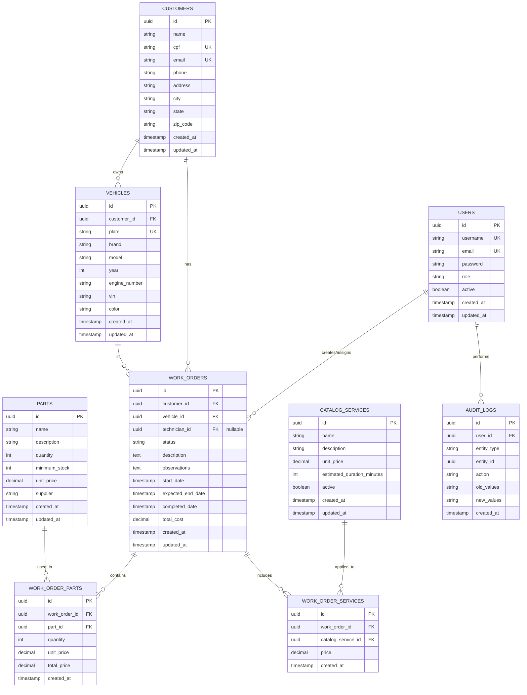

# Database Schema - Diagrama de Entidades

## Visão Geral do Banco de Dados

O banco de dados PostgreSQL utiliza as seguintes tabelas principais para armazenar os dados do sistema de oficina.

## Diagrama ER (Entity-Relationship)



## Tabelas Detalhadas

### USERS
Armazena informações de usuários do sistema.

```sql
CREATE TABLE users (
    id UUID PRIMARY KEY DEFAULT gen_random_uuid(),
    username VARCHAR(255) NOT NULL UNIQUE,
    email VARCHAR(255) NOT NULL UNIQUE,
    password VARCHAR(255) NOT NULL,
    role VARCHAR(50) NOT NULL, -- ADMIN, TECNICO, ATENDENTE, CLIENTE
    active BOOLEAN NOT NULL DEFAULT true,
    created_at TIMESTAMP NOT NULL DEFAULT CURRENT_TIMESTAMP,
    updated_at TIMESTAMP NOT NULL DEFAULT CURRENT_TIMESTAMP
);

CREATE INDEX idx_users_username ON users(username);
CREATE INDEX idx_users_email ON users(email);
CREATE INDEX idx_users_role ON users(role);
```

**Campos**:
- `id`: Identificador único
- `username`: Nome de usuário para login
- `email`: Email do usuário
- `password`: Senha hasheada (bcrypt)
- `role`: Papel/permissão (ADMIN, TECNICO, ATENDENTE, CLIENTE)
- `active`: Indica se usuário está ativo
- `created_at`: Data de criação
- `updated_at`: Data de última atualização

### CUSTOMERS
Armazena dados dos clientes que trazem seus veículos à oficina.

```sql
CREATE TABLE customers (
    id UUID PRIMARY KEY DEFAULT gen_random_uuid(),
    name VARCHAR(255) NOT NULL,
    cpf VARCHAR(14) NOT NULL UNIQUE,
    email VARCHAR(255) NOT NULL UNIQUE,
    phone VARCHAR(20),
    address VARCHAR(500),
    city VARCHAR(100),
    state VARCHAR(2),
    zip_code VARCHAR(10),
    created_at TIMESTAMP NOT NULL DEFAULT CURRENT_TIMESTAMP,
    updated_at TIMESTAMP NOT NULL DEFAULT CURRENT_TIMESTAMP
);

CREATE INDEX idx_customers_cpf ON customers(cpf);
CREATE INDEX idx_customers_email ON customers(email);
CREATE INDEX idx_customers_name ON customers(name);
```

**Campos**:
- `id`: Identificador único
- `name`: Nome completo do cliente
- `cpf`: CPF (único)
- `email`: Email de contato
- `phone`: Telefone de contato
- `address`: Endereço completo
- `city`: Cidade
- `state`: Estado (UF)
- `zip_code`: CEP

### VEHICLES
Armazena informações dos veículos que chegam à oficina.

```sql
CREATE TABLE vehicles (
    id UUID PRIMARY KEY DEFAULT gen_random_uuid(),
    customer_id UUID NOT NULL,
    plate VARCHAR(10) NOT NULL UNIQUE,
    brand VARCHAR(100) NOT NULL,
    model VARCHAR(100) NOT NULL,
    year INT,
    engine_number VARCHAR(50),
    vin VARCHAR(50) UNIQUE,
    color VARCHAR(50),
    created_at TIMESTAMP NOT NULL DEFAULT CURRENT_TIMESTAMP,
    updated_at TIMESTAMP NOT NULL DEFAULT CURRENT_TIMESTAMP,
    FOREIGN KEY (customer_id) REFERENCES customers(id) ON DELETE CASCADE
);

CREATE INDEX idx_vehicles_customer_id ON vehicles(customer_id);
CREATE INDEX idx_vehicles_plate ON vehicles(plate);
CREATE INDEX idx_vehicles_vin ON vehicles(vin);
```

**Campos**:
- `id`: Identificador único
- `customer_id`: ID do cliente proprietário
- `plate`: Placa do veículo
- `brand`: Marca (ex: Ford, Chevrolet)
- `model`: Modelo (ex: Fiesta, Uno)
- `year`: Ano de fabricação
- `engine_number`: Número do motor
- `vin`: Número de identificação do veículo
- `color`: Cor do veículo

### WORK_ORDERS
Armazena as ordens de trabalho criadas.

```sql
CREATE TABLE work_orders (
    id UUID PRIMARY KEY DEFAULT gen_random_uuid(),
    customer_id UUID NOT NULL,
    vehicle_id UUID NOT NULL,
    technician_id UUID,
    status VARCHAR(50) NOT NULL, -- CREATED, SCHEDULED, IN_PROGRESS, COMPLETED, CLOSED, CANCELLED
    description TEXT NOT NULL,
    observations TEXT,
    start_date TIMESTAMP,
    expected_end_date TIMESTAMP,
    completed_date TIMESTAMP,
    total_cost DECIMAL(10, 2),
    created_at TIMESTAMP NOT NULL DEFAULT CURRENT_TIMESTAMP,
    updated_at TIMESTAMP NOT NULL DEFAULT CURRENT_TIMESTAMP,
    FOREIGN KEY (customer_id) REFERENCES customers(id),
    FOREIGN KEY (vehicle_id) REFERENCES vehicles(id),
    FOREIGN KEY (technician_id) REFERENCES users(id)
);

CREATE INDEX idx_work_orders_customer_id ON work_orders(customer_id);
CREATE INDEX idx_work_orders_vehicle_id ON work_orders(vehicle_id);
CREATE INDEX idx_work_orders_technician_id ON work_orders(technician_id);
CREATE INDEX idx_work_orders_status ON work_orders(status);
CREATE INDEX idx_work_orders_created_at ON work_orders(created_at);
```

**Campos**:
- `id`: Identificador único
- `customer_id`: ID do cliente
- `vehicle_id`: ID do veículo
- `technician_id`: ID do técnico atribuído (nullable)
- `status`: Estado atual da ordem
- `description`: Descrição do trabalho solicitado
- `observations`: Observações adicionais
- `start_date`: Data de início do trabalho
- `expected_end_date`: Data prevista de conclusão
- `completed_date`: Data de conclusão efetiva
- `total_cost`: Custo total da ordem

### WORK_ORDER_PARTS
Relacionamento entre ordens de trabalho e peças utilizadas.

```sql
CREATE TABLE work_order_parts (
    id UUID PRIMARY KEY DEFAULT gen_random_uuid(),
    work_order_id UUID NOT NULL,
    part_id UUID NOT NULL,
    quantity INT NOT NULL,
    unit_price DECIMAL(10, 2) NOT NULL,
    total_price DECIMAL(10, 2) NOT NULL,
    created_at TIMESTAMP NOT NULL DEFAULT CURRENT_TIMESTAMP,
    FOREIGN KEY (work_order_id) REFERENCES work_orders(id) ON DELETE CASCADE,
    FOREIGN KEY (part_id) REFERENCES parts(id)
);

CREATE INDEX idx_work_order_parts_work_order ON work_order_parts(work_order_id);
CREATE INDEX idx_work_order_parts_part ON work_order_parts(part_id);
```

**Campos**:
- `id`: Identificador único
- `work_order_id`: ID da ordem de trabalho
- `part_id`: ID da peça utilizada
- `quantity`: Quantidade utilizada
- `unit_price`: Preço unitário da peça
- `total_price`: Preço total (quantity × unit_price)

### PARTS
Armazena informações do estoque de peças.

```sql
CREATE TABLE parts (
    id UUID PRIMARY KEY DEFAULT gen_random_uuid(),
    name VARCHAR(255) NOT NULL,
    description TEXT,
    quantity INT NOT NULL DEFAULT 0,
    minimum_stock INT NOT NULL DEFAULT 5,
    unit_price DECIMAL(10, 2) NOT NULL,
    supplier VARCHAR(255),
    created_at TIMESTAMP NOT NULL DEFAULT CURRENT_TIMESTAMP,
    updated_at TIMESTAMP NOT NULL DEFAULT CURRENT_TIMESTAMP
);

CREATE INDEX idx_parts_name ON parts(name);
CREATE INDEX idx_parts_quantity ON parts(quantity);
```

**Campos**:
- `id`: Identificador único
- `name`: Nome da peça
- `description`: Descrição detalhada
- `quantity`: Quantidade em estoque
- `minimum_stock`: Quantidade mínima (alerta)
- `unit_price`: Preço unitário
- `supplier`: Fornecedor da peça

### CATALOG_SERVICES
Armazena o catálogo de serviços oferecidos.

```sql
CREATE TABLE catalog_services (
    id UUID PRIMARY KEY DEFAULT gen_random_uuid(),
    name VARCHAR(255) NOT NULL UNIQUE,
    description TEXT,
    unit_price DECIMAL(10, 2) NOT NULL,
    estimated_duration_minutes INT,
    active BOOLEAN NOT NULL DEFAULT true,
    created_at TIMESTAMP NOT NULL DEFAULT CURRENT_TIMESTAMP,
    updated_at TIMESTAMP NOT NULL DEFAULT CURRENT_TIMESTAMP
);

CREATE INDEX idx_catalog_services_active ON catalog_services(active);
```

**Campos**:
- `id`: Identificador único
- `name`: Nome do serviço (ex: Troca de óleo)
- `description`: Descrição
- `unit_price`: Preço do serviço
- `estimated_duration_minutes`: Tempo estimado em minutos
- `active`: Se o serviço está disponível

### WORK_ORDER_SERVICES
Relacionamento entre ordens de trabalho e serviços aplicados.

```sql
CREATE TABLE work_order_services (
    id UUID PRIMARY KEY DEFAULT gen_random_uuid(),
    work_order_id UUID NOT NULL,
    catalog_service_id UUID NOT NULL,
    price DECIMAL(10, 2) NOT NULL,
    created_at TIMESTAMP NOT NULL DEFAULT CURRENT_TIMESTAMP,
    FOREIGN KEY (work_order_id) REFERENCES work_orders(id) ON DELETE CASCADE,
    FOREIGN KEY (catalog_service_id) REFERENCES catalog_services(id)
);

CREATE INDEX idx_work_order_services_work_order ON work_order_services(work_order_id);
CREATE INDEX idx_work_order_services_service ON work_order_services(catalog_service_id);
```

**Campos**:
- `id`: Identificador único
- `work_order_id`: ID da ordem de trabalho
- `catalog_service_id`: ID do serviço do catálogo
- `price`: Preço cobrado

### AUDIT_LOGS
Armazena auditoria de todas as operações importantes.

```sql
CREATE TABLE audit_logs (
    id UUID PRIMARY KEY DEFAULT gen_random_uuid(),
    user_id UUID,
    entity_type VARCHAR(100) NOT NULL,
    entity_id UUID NOT NULL,
    action VARCHAR(50) NOT NULL, -- CREATE, UPDATE, DELETE
    old_values JSONB,
    new_values JSONB,
    created_at TIMESTAMP NOT NULL DEFAULT CURRENT_TIMESTAMP,
    FOREIGN KEY (user_id) REFERENCES users(id)
);

CREATE INDEX idx_audit_logs_user ON audit_logs(user_id);
CREATE INDEX idx_audit_logs_entity ON audit_logs(entity_type, entity_id);
CREATE INDEX idx_audit_logs_created_at ON audit_logs(created_at);
```

**Campos**:
- `id`: Identificador único
- `user_id`: ID do usuário que fez a alteração
- `entity_type`: Tipo de entidade (Customer, Vehicle, etc)
- `entity_id`: ID da entidade afetada
- `action`: Ação realizada (CREATE, UPDATE, DELETE)
- `old_values`: Valores anteriores em JSON
- `new_values`: Novos valores em JSON
- `created_at`: Data da auditoria

## Relacionamentos Principais

### Cascata de Deleção
- `customers → vehicles` (ON DELETE CASCADE): Deletar cliente deleta seus veículos
- `customers → work_orders` (implicado): Deletar cliente deve deletar suas ordens
- `work_orders → work_order_parts` (ON DELETE CASCADE): Deletar ordem deleta suas peças
- `work_orders → work_order_services` (ON DELETE CASCADE): Deletar ordem deleta seus serviços

### Integridade Referencial
- `vehicles.customer_id` referencia `customers.id`
- `work_orders.customer_id` referencia `customers.id`
- `work_orders.vehicle_id` referencia `vehicles.id`
- `work_orders.technician_id` referencia `users.id`
- `work_order_parts.work_order_id` referencia `work_orders.id`
- `work_order_parts.part_id` referencia `parts.id`

## Índices Estratégicos

| Tabela | Índice | Razão |
|--------|--------|-------|
| users | username, email | Buscas frequentes por login |
| customers | cpf, email, name | Buscas por identificação |
| vehicles | customer_id, plate, vin | Filtro por cliente |
| work_orders | customer_id, vehicle_id, status, created_at | Filtros comuns |
| work_order_parts | work_order_id, part_id | Joins frequentes |
| catalog_services | active | Filtro de serviços disponíveis |
| audit_logs | user_id, entity_type, created_at | Consultas de auditoria |

## Constraints Importantes

### Unicidade
- `users.username` - Nomes de usuário únicos
- `users.email` - Emails únicos
- `customers.cpf` - CPFs únicos
- `customers.email` - Emails únicos
- `vehicles.plate` - Placas únicas
- `vehicles.vin` - VINs únicos
- `catalog_services.name` - Nomes de serviços únicos

### Não Nulifiáveis
- `users`: username, email, password, role
- `customers`: name, cpf, email
- `vehicles`: customer_id, plate, brand, model
- `work_orders`: customer_id, vehicle_id, status, description
- `parts`: name, quantity, unit_price
- `catalog_services`: name, unit_price

## Queries Comuns

### Buscar ordens de um cliente
```sql
SELECT wo.* FROM work_orders wo
WHERE wo.customer_id = $1
ORDER BY wo.created_at DESC;
```

### Buscar peças em falta
```sql
SELECT * FROM parts
WHERE quantity <= minimum_stock
ORDER BY quantity ASC;
```

### Relatório de receita por período
```sql
SELECT 
    DATE_TRUNC('month', wo.created_at) as month,
    COUNT(*) as total_orders,
    SUM(wo.total_cost) as revenue
FROM work_orders wo
WHERE wo.status = 'COMPLETED'
GROUP BY DATE_TRUNC('month', wo.created_at)
ORDER BY month DESC;
```

### Performance de técnicos
```sql
SELECT 
    u.username,
    COUNT(wo.id) as total_orders,
    COUNT(CASE WHEN wo.status = 'COMPLETED' THEN 1 END) as completed,
    AVG(EXTRACT(DAY FROM (wo.completed_date - wo.start_date))) as avg_days
FROM users u
LEFT JOIN work_orders wo ON u.id = wo.technician_id
WHERE u.role = 'TECNICO'
GROUP BY u.id, u.username;
```

---

**Próximo passo**: Implementar migrations Flyway baseado neste schema.
