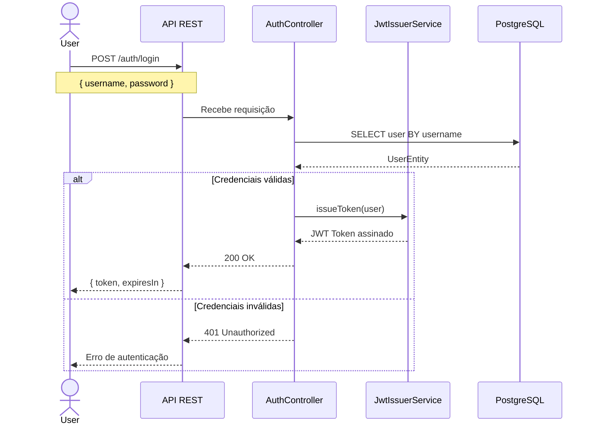
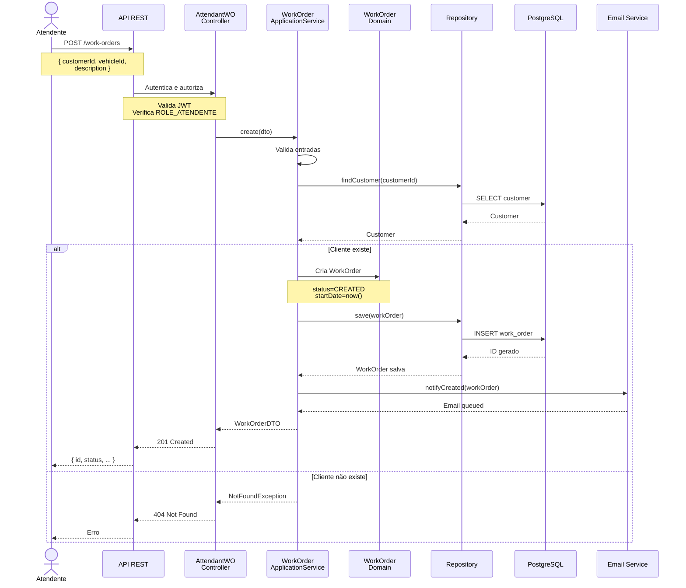
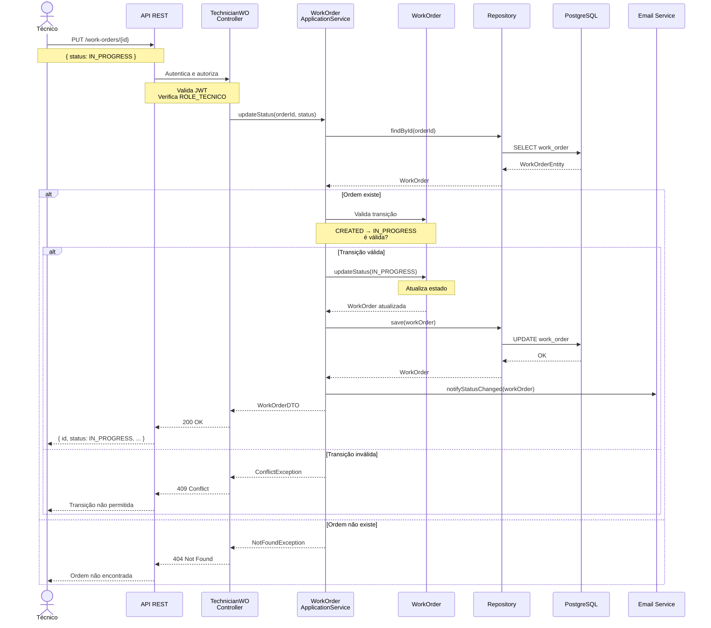
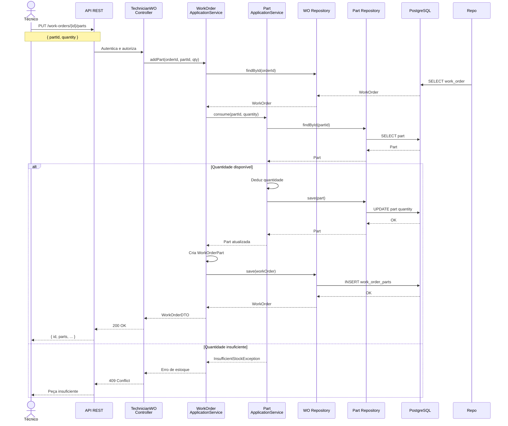
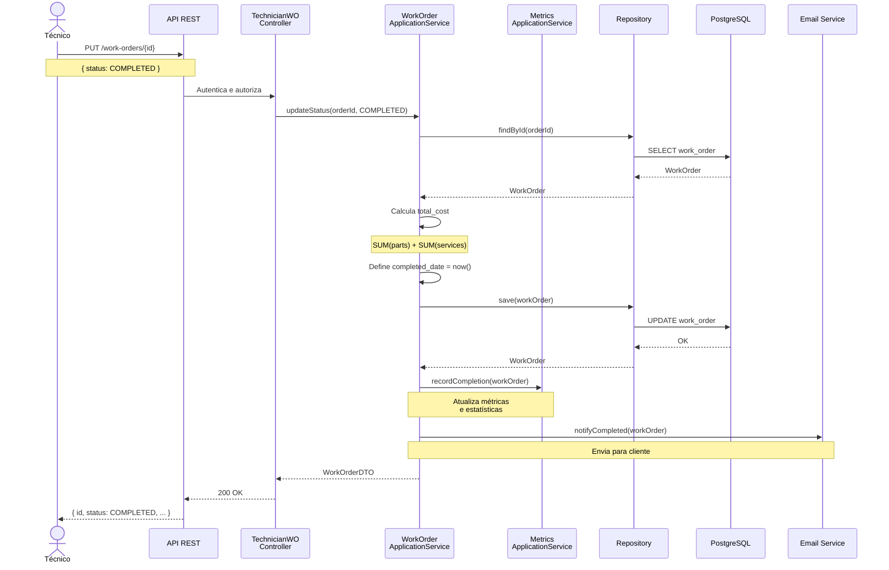
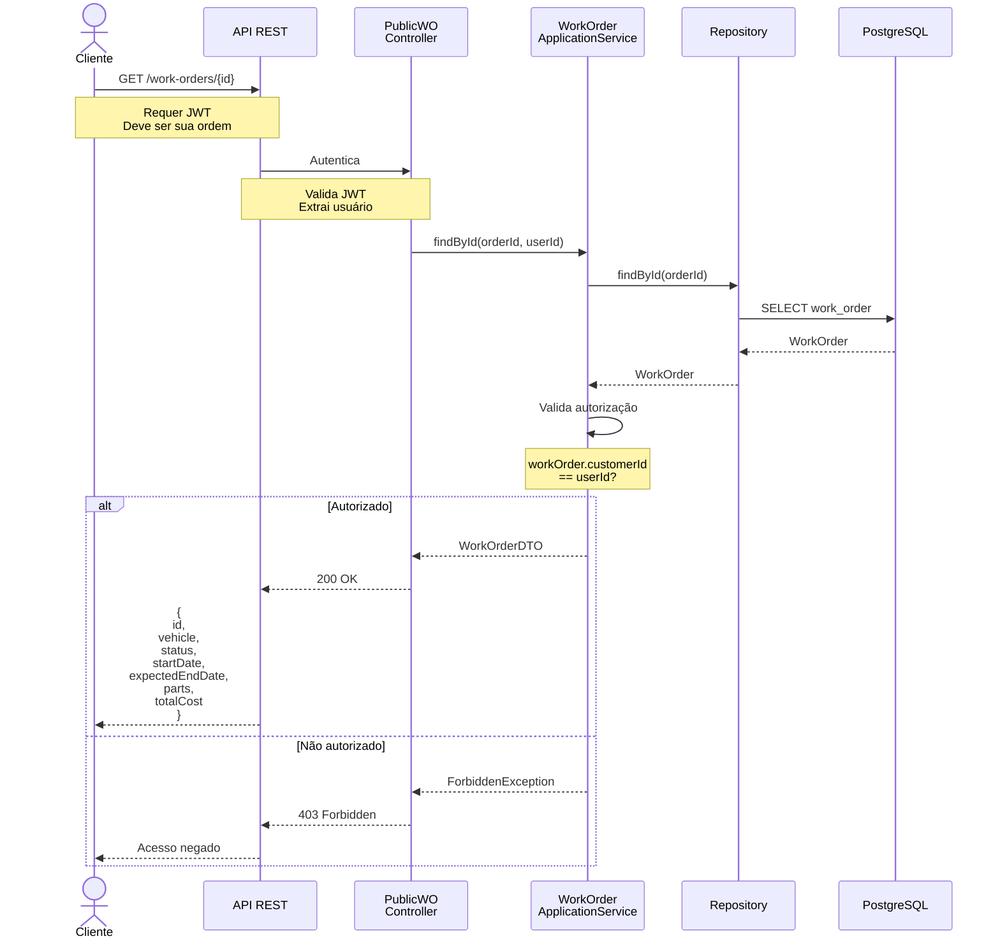
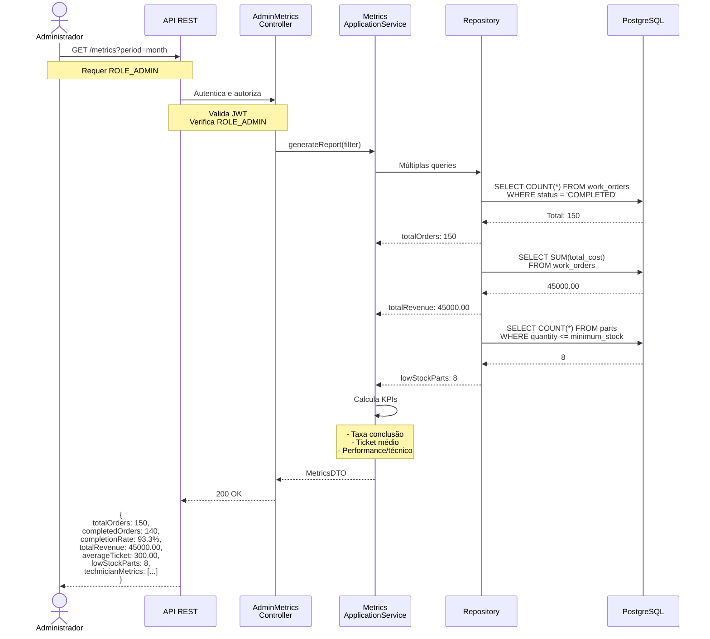
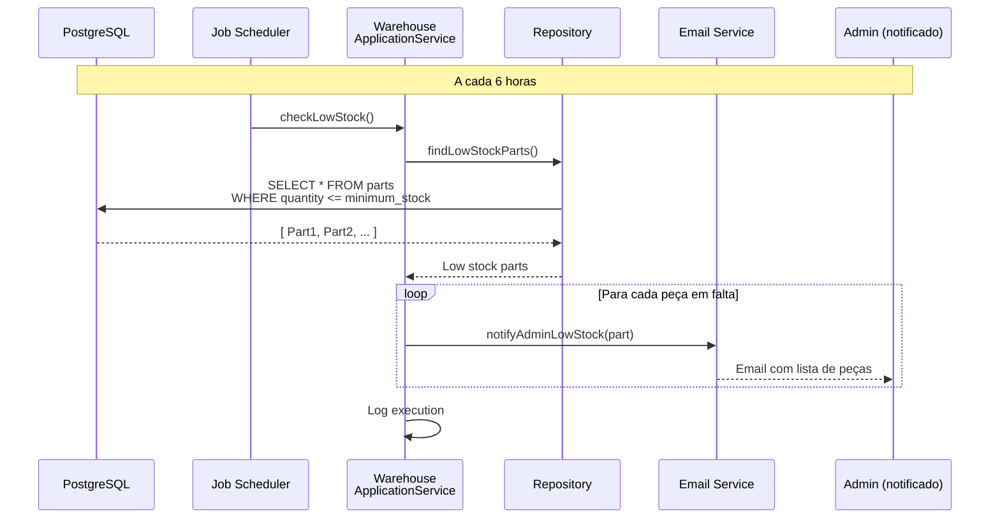
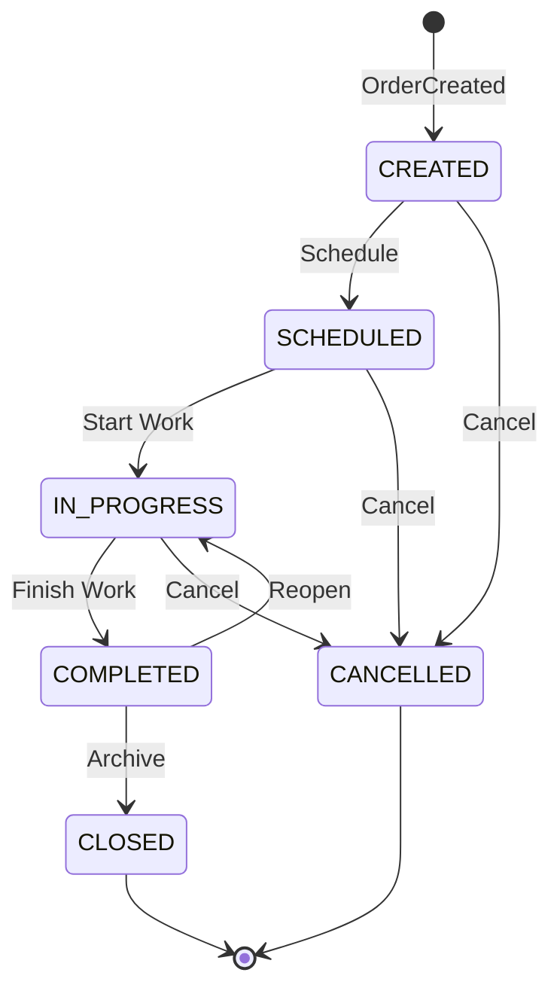
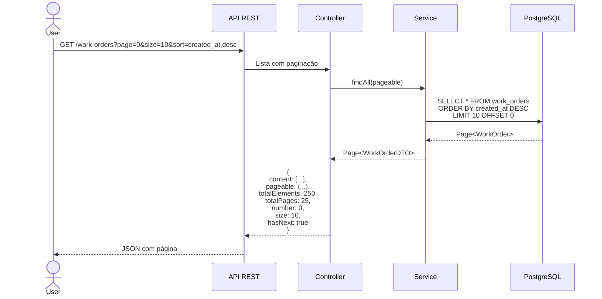

# Fluxos de Negócio - Sequence Diagrams

Este documento descreve os principais fluxos de negócio do sistema através de diagramas de sequência.

## 1. Autenticação e Geração de Token

**Descrição**:
1. Usuário envia credenciais
2. Sistema busca usuário no banco
3. Valida senha (bcrypt)
4. Gera JWT assinado
5. Retorna token ao cliente

**Duração**: ~200ms

---

## 2. Criar Ordem de Trabalho

**Descrição**:
1. Atendente envia dados da ordem
2. Sistema valida permissões
3. Verifica se cliente existe
4. Cria ordem com status CREATED
5. Persiste em PostgreSQL
6. Envia notificação por email
7. Retorna ordem criada

**Estados Envolvidos**: CREATED

**Duração**: ~500ms

---

## 3. Técnico Atualiza Status de Ordem

**Descrição**:
1. Técnico atualiza status
2. Sistema valida permissão
3. Busca ordem no banco
4. Valida transição de estado
5. Atualiza status
6. Notifica clientes interessados

**Estados Possíveis**:
- CREATED → SCHEDULED
- SCHEDULED → IN_PROGRESS
- IN_PROGRESS → COMPLETED
- COMPLETED → CLOSED
- Qualquer → CANCELLED

**Duração**: ~400ms

---

## 4. Técnico Registra Peça Utilizada

**Descrição**:
1. Técnico registra peça utilizada
2. Sistema valida disponibilidade
3. Deduz quantidade do estoque
4. Registra peça na ordem
5. Atualiza total de custos

**Validações**:
- Quantidade em estoque >= quantidade solicitada
- Ordem existe e está em estado apropriado

**Duração**: ~350ms

---

## 5. Concluir Ordem de Trabalho

**Descrição**:
1. Técnico marca ordem como completa
2. Sistema calcula custos totais
3. Define data de conclusão
4. Atualiza métricas
5. Notifica cliente

**Cálculos Automáticos**:
- Total = Σ(peças) + Σ(serviços)

**Duração**: ~600ms

---

## 6. Cliente Consulta Status de Ordem

**Descrição**:
1. Cliente solicita status de sua ordem
2. Sistema valida autorização
3. Retorna dados da ordem

**Segurança**:
- Cliente pode ver apenas suas próprias ordens
- Validação é feita em múltiplos níveis

**Duração**: ~200ms

---

## 7. Admin Gera Relatório de Métricas

**Descrição**:
1. Admin solicita métricas
2. Sistema executa múltiplas queries
3. Calcula KPIs agregados
4. Retorna relatório completo

**Métricas Disponíveis**:
- Total de ordens
- Ordens completadas
- Taxa de conclusão (%)
- Receita total
- Ticket médio
- Peças em falta
- Performance por técnico
- Tendências temporais

**Duração**: ~1000ms (querys agregadas)

---

## 8. Sistema de Baixo Estoque

**Descrição**:
1. Job scheduler executa periodicamente
2. Busca peças com estoque baixo
3. Envia notificação ao admin
4. Log para auditoria

**Frequência**: A cada 6 horas (configurável)

**Duração**: ~500ms

---

## Estados de Transição (State Machine)

**Transições Permitidas**:

| De | Para | Quem | Condição |
|----|------|------|----------|
| CREATED | SCHEDULED | Admin/Técnico | Sempre |
| CREATED | CANCELLED | Admin | Sempre |
| SCHEDULED | IN_PROGRESS | Técnico | Sempre |
| SCHEDULED | CANCELLED | Admin | Sempre |
| IN_PROGRESS | COMPLETED | Técnico | Sempre |
| IN_PROGRESS | CANCELLED | Admin | Sempre |
| COMPLETED | CLOSED | Admin | Sempre |
| COMPLETED | IN_PROGRESS | Admin | Se falha for detectada |

---

## Padrão de Paginação

---

Próximo passo: Implementar os controllers, services e repositories conforme estes fluxos.
